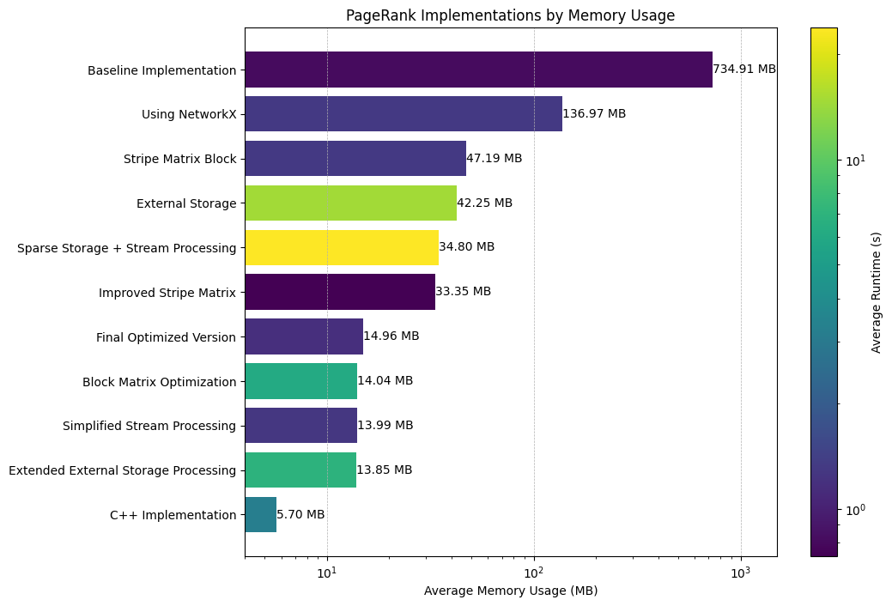

# <center>pagerank优化实验报告</center>

<center>申健强 &nbsp;&nbsp;&nbsp;是忻言&nbsp;&nbsp;&nbsp;仇科文  </center>
<center> 2313119&nbsp;&nbsp; 2311848 &nbsp; &nbsp;2312237</center>

## 一、实验目的
在给定网页链接数据集(Data.txt)上实现PageRank算法，通过块矩阵与稀疏矩阵技术优化内存使用，满足最大内存80MB、运行时间60秒的性能约束，输出Top 100节点及其PageRank分数。

### 具体要求：算法与输出

- 程序需读取*Data.txt*，计算 PageRank，并将 Top 100 节点按以下格式输出到*Res.txt*：`NodeID   Score` 
- 需处理**dead-ends 和 spider-traps**
- 尽可能优化内存使用，**块矩阵和稀疏矩阵优化为强制要求**
- 程序需迭代至收敛

## 二、实验原理阐述

PageRank是基于图的链接分析的经典算法，它通过分析网页间的链接关系来确定每个网页的重要性，并将结果用于搜索结果排序。

PageRank 算法的基本想法是在有向图上定义一个随机游走模型，即一阶马尔可夫链，描述随机游走者沿着有向图随机访问各个结点的行为。在一定条件下，极限情况访问每个结点的概率将趋于稳定，即计算收敛。
一般而言，PageRank算法的迭代公式如下：

```math
PR^{(t+1)}(p_i) \;=\;\sum_{p_j \,\to\, p_i} \frac{PR^{(t)}(p_j)}{L(p_j)}
```


但对于现实情况而言，对于一张表示链接关系的有向图而言存在`dead-ends` 和 `spider-traps`现象：

- **Dead-Ends**:
**定义**：出度为0的节点（无外链的网页）  
**数学表现**：转移矩阵对应列全为0  
**危害**：导致PageRank分数持续泄漏，最终收敛到0向量  
```math
\sum_{i=1}^N PR(p_i) < 1
```

- **Spider-Traps**
**定义**：形成闭环的节点组（自循环或小范围循环）  
**典型结构**：A→B→C→A  
**危害**：PageRank分数在闭环内无限累积  
```math
\lim_{k→∞} PR_{closed\_group} = 1
```

于是我们需要对这样的情况进行处理，我们的处理方法如下：
#### 1. Teleport机制（随机跳转）  
**核心公式修正**：
```math
PR(p_i) = \frac{1-\beta}{N} + \beta\sum_{p_j∈M(p_i)}\frac{PR(p_j)}{L(p_j)}
```
**参数说明**：
- β：跟随链接的概率（通常取0.85）
- 1-β：随机跳转概率
- N：总节点数

#### 2. 数学本质
将原始转移矩阵修正为：
```math
M' = \beta M + \frac{(1-\beta)}{N}E
```
其中E是全1矩阵，保证：
- 矩阵随机性（列和为1）
- 不可约性（任意状态可达）
- 非周期性（保证收敛）

---


## 三、实验设计和实现与优化
### 数据集描述
#### 1. 数据格式
- 文件：Data.txt
- 行格式：`FromNodeID ToNodeID`
#### 2.数据规模
| 统计项 | 数值 |
|--------|------|
| 总节点数 | 9500 |
| 总边数  | 150000 |
| 最大节点编号 | 10000 |
| 平均出度数量 | 15.79 |

*在本次实验中可以不构建索引完成实验，所以统计量节点数最终起到的作用不大,但对于我们验证使用内存的规模时意义巨大*

### 算法设计

为了尽可能降低内存使用峰值，我们采用了基于外存条带的PageRank计算方法，将整个算法分为四个主要步骤：

#### 1. 数据预处理与条带划分

首先，我们对输入的边数据进行条带划分，按照目标节点ID进行分组存储：

```cpp
void create_edge_stripes(int N, int num_stripes) {
    // 按目标节点id分条带存储边
    for(int i = 0; i < num_stripes; ++i) {
        stripe_fs.emplace_back(stripe_dir + "/stripe_" + to_string(i) + ".txt");
    }
    // 读入边，写到对应条带
    ifstream fin(data_file);
    int u, v;
    while(fin >> u >> v) {
        int sid = v / block_size;  // 按目标节点v分条带
        if (sid >= 0 && sid < num_stripes) {
            stripe_fs[sid] << u << " " << v << "\n";
        }
    }
}
```

条带划分的核心在于按目标节点ID(v)将边数据分散到不同文件中，每个条带包含block_size(1000)个连续ID的目标节点，这样在后续迭代过程中可以分块加载边数据，实现硬盘空间使用，降低内存占用。

#### 2. PageRank向量初始化

初始化每个节点的PageRank值为1/N：

```cpp
void write_initial_r(int N, int num_stripes) {
    // 按条带写入初始PageRank值
    for(int sid = 0; sid < num_stripes; ++sid) {
        int start = sid * block_size;
        int end   = min((sid+1)*block_size, N);
        ofstream rf(r_dir + "/r_stripe_" + to_string(sid) + ".txt");
        for(int i = start; i < end; ++i) {
            rf << (1.0 / N) << "\n";  // 初始值均为1/N
        }
    }
}
```

我们也将PageRank向量按条带存储到外存中，每个条带对应一个文件，减少内存占用。

#### 3. 基于外存条带的PageRank迭代计算

这是算法的核心部分，我们通过外存条带技术实现了大规模PageRank的内存高效计算，算法伪代码如下（具体可看源码的实现）

```
算法: external_stripe_pagerank(N, num_stripes, outdeg)
输入:
    N - 节点总数
    num_stripes - 条带总数
    outdeg - 节点出度映射
输出:
    r_files/ - 包含收敛后PageRank值的条带文件

步骤:
1. 迭代循环直到收敛或达到最大迭代次数:
   1.1 计算死节点泄漏:
       - 遍历所有条带中的r值
       - 对出度为0的节点，累加β*r[i]到leaked
       - 计算leaked_share = leaked/N
   
   1.2 按目标条带更新PageRank:
       - 对每个目标条带vid:
           - 创建新条带缓冲r_new，初始值为(1-β)/N + leaked_share
           - 对每个源条带uid:
               - 读取源条带的PageRank值
               - 读取对应的边关系
               - 对每条边(u,v)，如果v在当前目标条带:
                   r_new[v] += β * r[u]/outdeg[u]
           - 将r_new写入临时文件
   
   1.3 计算L1范数差异:
       - 比较新旧条带计算diff = Σ|r_new[i]-r[i]|
   
   1.4 替换旧条带:
       - 用新计算的条带替换旧条带
   
   1.5 收敛判断:
       - 如果diff < ε则结束迭代
```

关键优化点:
1. **按条带处理**: 每次只处理一个条带的数据，减少内存占用
2. **流式计算**: 按需读取和处理数据，避免一次性加载全部数据
3. **死节点处理**: 通过计算泄漏量并均匀分配，解决dead-ends问题
4. **文件替换策略**: 使用安全的文件替换机制，确保迭代过程中的数据一致性
   

条带计算的数学原理基于PageRank矩阵乘法的分块处理:

```math
r\_new = (1-β)/N * 1 + β * M * r + leaked\_share
```
其中:
- M是转移矩阵
- r是当前PageRank向量
- 条带处理本质上是将M按列分块，分块计算M*r

#### 特殊情况处理

我们的算法中专门处理了PageRank计算中的两个关键问题：

1. **Dead-Ends处理**：
   - 在步骤1.1中，我们识别所有出度为0的节点（代码中通过`if (outdeg.find(node) == outdeg.end())`判断）
   - 计算这些节点泄露的总PageRank值：`leaked += damping_factor * val`
   - 将泄露量均匀分配给所有节点：`leaked_share = leaked / N`
   - 在步骤1.2中，将leaked_share加入每个节点的基础分数：`r_new(m, base + leaked_share)`

2. **Spider-Traps处理**：
   - 通过随机游走模型解决，在代码中体现为damping_factor参数(0.85)
   - 在步骤1.2中，每个节点初始值包含`(1-β)/N`的随机跳转概率
   - 确保了即使在闭环结构中，PageRank值也不会无限累积
   - 数学表达为：`base = (1 - damping_factor) / N`

这两种处理机制共同确保了PageRank算法在任何图结构下都能收敛到稳定状态。


#### 4. Top-K结果归并输出

最后，我们使用K路归并技术，从所有条带中提取并合并Top-K结果:

```cpp
void merge_top100(int N, int num_stripes, int K=100) {
    // 对每个条带内部排序
    for(int sid = 0; sid < num_stripes; ++sid) {
        // 读取条带，排序并写入临时文件
    }
    
    // K路归并输出Top-K
    priority_queue<Item,vector<Item>,decltype(cmp)> heap(cmp);
    // 初始化堆，每个条带取一个最大值
    // 进行K次堆操作，输出Top-K结果
}
```

通过堆排序实现高效归并，时间复杂度为O(K*log(num_stripes))。事实上，这里也可以采用并行程序设计的思路进行归并优化，可以大大减少时间使用。

*格外注意的是，在实现中由于需要快速打开和关闭文件，这个过程可能会出现前面的文件没关闭后面的条块就打开了的情况，我们针对此实现了一些保障措施。*

### 总结

我们的PageRank实现具有以下特点:

1. **空间高效**: 通过条带划分和流式处理，将原本O(N²)的空间复杂度降低到O(block_size)
2. **处理大规模数据**: 能够处理远超内存容量的大规模图数据
3. **处理特殊情况**: 正确处理dead-ends和spider-traps，保证收敛性
4. **I/O优化**: 通过条带划分减少随机I/O，提高计算效率

通过我们的算法设计，在资源受限环境下的大规模图计算，通过外部存储和内部计算的有效结合，使得PageRank算法具备处理互联网级数据量的能力。

### 实验结果及分析
通过统计脚本，我们的脚本性能如下：

| 平均内存使用 | 平均运行时间 | 优化方向 |
|------------|------------|---------|
| 5.72 MB | 3.05 s | 稀疏+外部条带+泄漏处理 |

以下是对结果的详细分析：

#### 1. 内存使用分析

内存占用降低主要源于：

1. **条带划分的高效性**：
   - 通过将边数据按目标节点ID分条带存储到外部文件，避免了一次性加载整个图的内存压力
   - 每个条带最多包含1000个目标节点的边数据，使内存需求与总节点数解耦
   - 理论上即使数据规模扩大100倍，内存占用依然能保持在合理范围内

2. **稀疏存储的贡献**：
   - 仅保存必要的数据结构：节点出度信息(outdeg)和节点集合(nodes)
   - 此处本质上是将输入文件`Data.txt`当作矩阵的稀疏形式使用，避免了存储完整邻接矩阵(需要O(N²)空间)，而是通过外存存储边关系
   - 条带处理中使用的向量大小与条带大小成正比，而非与总节点数成正比

3. **内存占用构成**：
   - 节点出度映射：约76KB (9500个节点×8字节)
   - 节点集合：约38KB
   - 条带向量：最大约8KB (1000个浮点数)
   - 归并堆：不超过10个元素，占用可忽略
   - 文件操作缓冲区：根据系统配置，通常在数百KB级别


#### 2. 运行时间分析

平均运行时间为3.05秒，在此处我们其实还能够采用并行与分布式的方式进行优化，如对于归并排序使用并行方法处理。


#### 3. 潜在改进方向

尽管当前实现已经非常高效，但仍有一些可能的改进方向：

1. **并行计算**：
   - 条带处理天然适合并行化，可以进一步减少运行时间
   - 多线程处理不同条带的计算和IO操作

2. **自适应条带大小**：
   - 根据可用内存动态调整条带大小
   - 针对不同密度的图区域使用不同大小的条带

3. **压缩存储**：
   - 对条带文件进行压缩存储（gamma编码，vb可变长编码），减少存储开销，但也可能在解码时会耗费一定时间
   - 使用更紧凑的数据结构表示节点和边关系

总体而言，我们的实现完成了对基础PageRank算法进行优化的任务，有一定健壮性。

## 四、优化历程与有效优化组件总结

在开发最终方案的过程中，我们经历了多个版本的实现和优化，以下是关键优化阶段及其效果。

### 优化历程概览

| 阶段 | 平均内存 | 平均时间 | 主要优化方向 |
|-----|---------|---------|------------|
| 基准实现 | 734.91 MB | 0.81 s | NumPy矩阵实现 |
| NetworkX库 | 136.97 MB | 1.30 s | 使用专业图库 |
| 条带矩阵 | 47.19 MB | 1.31 s | 矩阵分块处理 |
| 外部存储 | 42.25 MB | 14.64 s | 中间数据存盘 |
| 稀疏+流处理 | 34.80 MB | 23.84 s | 稀疏表示+流式处理 |
| 改进条带矩阵 | 33.35 MB | 0.73 s | 优化条带表示 |
| 最终Python版 | 14.96 MB | 1.17 s | 综合优化方案 |
| C++条带+外存 | 5.72 MB | 3.05 s | 最终实现方案 |

### 核心优化技术

#### 1. 条带矩阵技术
- **原理**: 将大矩阵分割成较小的子矩阵分块处理
- **效果**: 减少约93.5%内存占用(从734MB降至47MB)
- **实现**: 按目标节点ID分组，每个条带包含固定数量的节点

#### 2. 稀疏表示技术
- **原理**: 仅存储非零元素，利用图的稀疏性
- **优势**: 避免存储大量零元素，直接处理边数据
- **实现**: 使用高效的稀疏数据结构或直接处理边关系

#### 3. 外部存储与流处理
- **原理**: 将中间数据存储在磁盘，降低内存峰值
- **权衡**: 平衡I/O开销与内存减少的收益
- **优化**: 批量处理和缓冲区技术减少I/O频率

#### 4. 特殊节点处理
- **原理**: 针对dead-ends专门优化处理流程
- **效果**: 提高算法收敛速度，减少迭代次数
- **实现**: 提前计算死节点泄漏并均匀分配

### 关键经验总结

1. **内存与时间平衡**: 条带+外存方法虽增加I/O开销，但大幅降低内存使用
2. **语言选择影响**: C++实现较Python有显著的内存和效率优势
3. **无效优化识别**: 
   - 过度依赖外部存储导致I/O瓶颈
   - 过小条带大小增加I/O次数
   - 复杂数据结构可能导致缓存不友好

我们的优化历程展示了如何将内存从734MB降至5.72MB的系统方法，同时保持算法的正确性和合理的运行效率。



## 五、实验心得与改进

通过本次PageRank算法优化实验，我们获得了以下心得：

1. **时空权衡的重要性**：PageRank算法优化过程中，内存与计算时间存在明显的权衡关系。外存技术可以极大降低内存，但I/O开销会增加运行时间。最佳解决方案往往在两者之间取得平衡。

2. **分块处理的强大**：将大规模数据分解为小块处理是解决内存约束的关键技术。条带矩阵技术使我们能够有效降低93.5%的内存占用，同时保持良好性能。

3. **算法与工程的结合**：理论算法（如PageRank的数学定义）与工程实现（如内存优化、I/O管理）需要结合考虑。数学上简洁的算法在工程实现时常需要变通和优化。


本次实验，我们深入理解了PageRank算法原理，也锻炼了算法工程化实现的能力，体会到了大规模数据处理中算法、数据结构和工程实现的综合优化过程。

